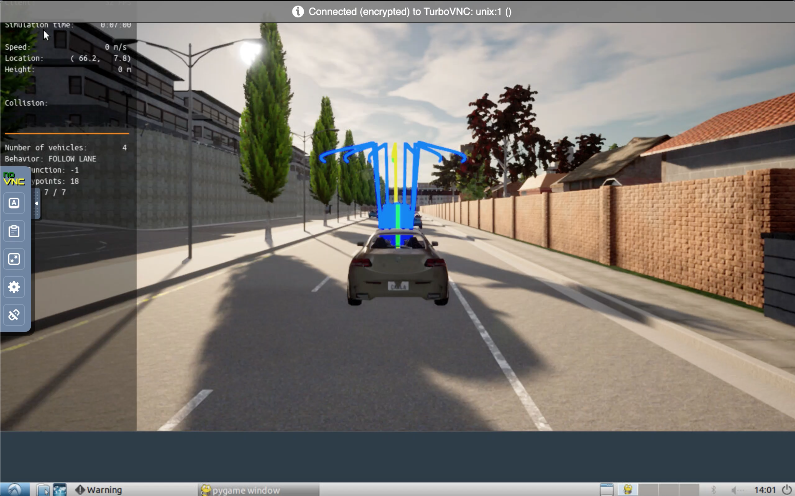
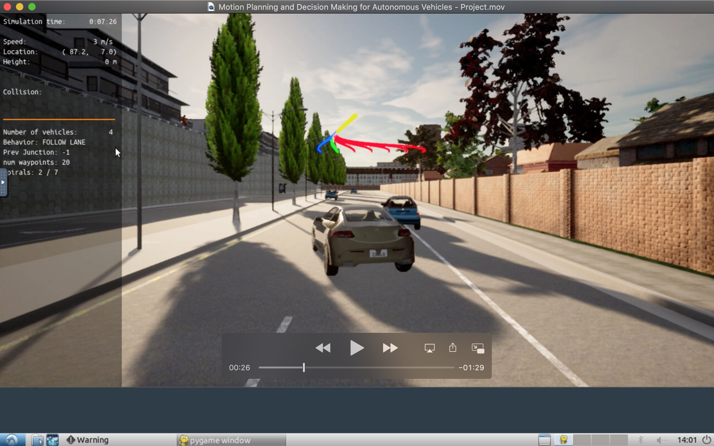
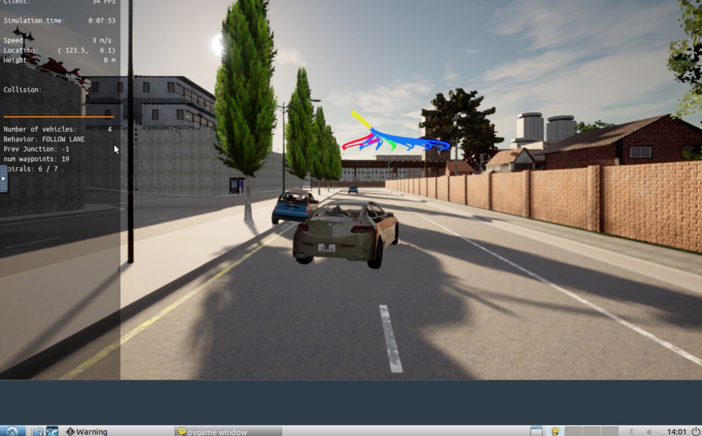
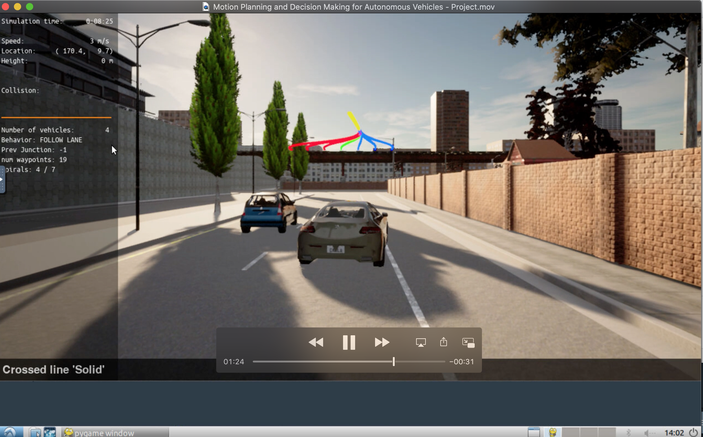
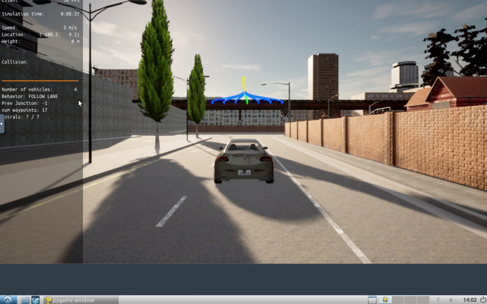
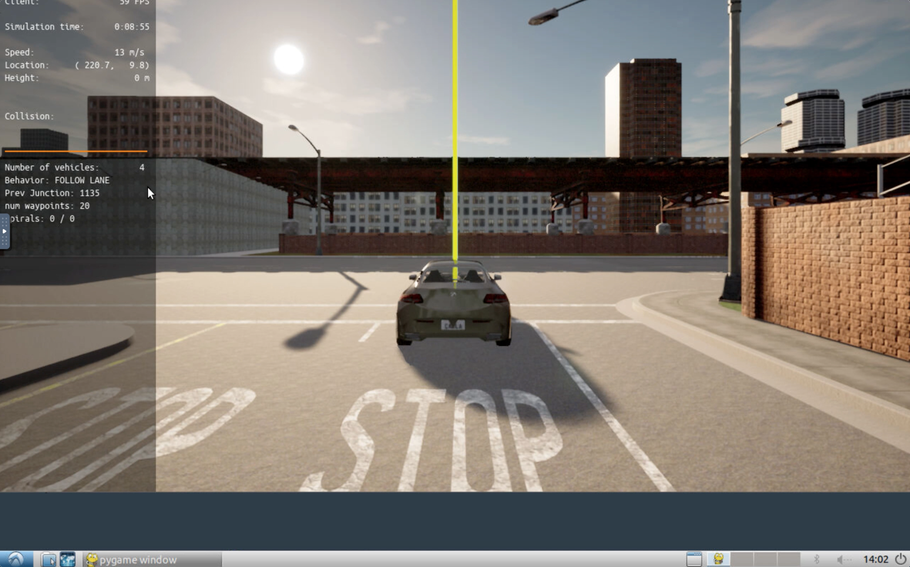

# Motion Planning and Decision Making for Autonomous Vehicles
Motion planning and decision making is very curcial for autonomus vehicles. Both helps on following aspects
1. Avoid static objects (cars, bicycles and trucks) parked on the side of the road (but still invading the lane). The vehicle must avoid crashing with these vehicles by executing either a “nudge” or a “lane change” maneuver.
2. Handle any type of intersection (3-way, 4-way intersections and roundabouts) by STOPPING in all of them (by default)
3. Track the centerline on the traveling lane.

# How Motion Planning and Decision Making are implemented?
1. Behavioral planning logic using Finite State Machines - FSM
2. Static objects collision checking.
3. Path and trajectory generation using cubic spirals
4. Best trajectory selection though a cost function evaluation. This cost function will mainly perform a collision check and a proximity check to bring cost higher as we get closer or collide with objects but maintaining a bias to stay closer to the lane center line.

# Important files
Following are important files which required changes to complet the project
1. [behavior_planner_FSM.cpp](project/starter_files/behavior_planner_FSM.cpp)
2. [cost_functions.cpp](project/starter_files/cost_functions.cpp)
3. [motion_planner.cpp](project/starter_files/motion_planner.cpp)
4. [velocity_profile_generator.cpp](project/starter_files/velocity_profile_generator.cpp)
5. [planning_params.h](project/starter_files/planning_params.h)
6. [behavior_planner_FSM.cpp](project/starter_files/behavior_planner_FSM.cpp)

# Observations
After making changes in the all the required files, run the simulation as mentioned in the [how_to_run.txt](project/how_to_run.txt).
Watch complete video at 

## Car drives in target lane

## Change lane for other car parked on right side

## Car come back to target lane

## Change lane for other car parked on left side

## Car come back to target lane

## Car stops

# Conclusion
Car was able to start journey following the target lane and driving at the center of the lane. Car was able to detect the parked object (other car) on both right and left side and was able to change lane to avoid the collision.

